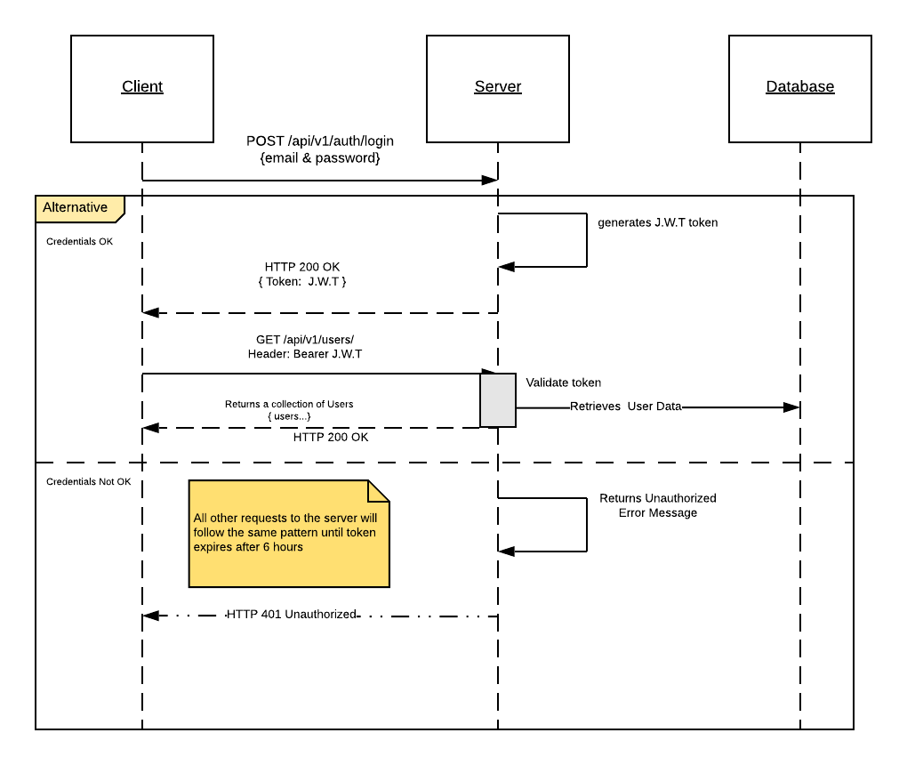

# WiredCraft Back-end Developer Test

## Table of Content
* [Architecture](#architecture)
  * [Technical Stack](#tech-stack)
* [Design](#design)
  * [Authentication](#authentication)
    * [UML Diagram](#uml-sequence-diagram)
    * [Authentication and Authorization Strategy](#authentication-and-authorization-strategy)
  * [Logging](#logging)
  * [Testing](#testing)
* [Setup](#setup)
* [Improvements](#improvements)

## Architecture

### Technical Stack

- Framework -> Loopback 4
  * I choose loopback 4 because of speed and it's extensibility. Loopback's codebase is well structured and saves you the headache of thinking about that. Also, for personal preference,
  I lean towards strongly typed languages due to my experience with Go and Java.
- Testing -> Mocha
- Database -> MongoDB 4
- Deployment -> Docker

## Design

### Authentication

#### UML Sequence Diagram

<p>Below is the UML sequence diagram for the user login flow. Assuming the user has already been created. </p>



#### Authentication and Authorization Strategy

- JWT authentication strategy is implemented in this solutions.

  - User makes a ```login``` request with an email and password and a JWT token is issue back to the user if the request is successful.

  - User then uses this token in to make other requests to server. Once the token is validated, the request with will authorized.

  - Token expires after 6 hours.

*The sequence diagram above provides a visual representation of the authentication/authorization flow.*

## Logging

  Winston is used as a logger for the application. There is a dedicated `/logs` folder to store the logs during runtime. Logging to the console has also been enabled. I want to be able to log all everything under the `debug`, `error` and `info` levels.

## Testing

Acceptance tests has been for all controllers and services and services have been implemented.

## Setup
Use the following steps to setup the application.

- Install `Node 10 or above`

- Create a ```.env``` file by duplicating ```.env.example``` file. Edit the .env variables to conform with the setup you desire.

- Setup Mongo DB server by running ```docker-compose up -d```.

- Run ```yarn start```.

- Health check the api by visiting ```localhost:3000/api/v1/health```

- The api docs can be accessed through ```localhost:3000/api/v1/swagger```.

- Simply run ```yarn test``` to run the tests of the application.

## Improvements

There are quiet a few things that I think can be implemented to improve this solution:

* User Sessions

* Refreshing token

* Adding Rate limiter to DoS attacks.
